# VideoDub - AI Video Translation Pipeline

A comprehensive Python pipeline that downloads YouTube videos, translates their transcripts to different languages using advanced sentence reconstruction, generates natural-sounding audio in the target language with AI-powered text-to-speech services, and creates fully dubbed videos with real-time cost tracking.

### Core Components

#### 1. **Core Pipeline (`src/videodub/core/`)**
- **`pipeline.py`** - Main orchestrator with cost tracking integration
- **`models.py`** - Data models with sentence context support
- **`interfaces.py`** - Service interfaces and contracts
- **`exceptions.py`** - Comprehensive error handling

#### 2. **Configuration System (`src/videodub/config/`)**
- **`settings.py`** - Pydantic-based configuration with validation
- **`validation.py`** - Input validation and sanitization
- Manages API keys for OpenAI, Google, and Azure services
- Defines supported languages and TTS engines with pricing

#### 3. **Video Processing (`src/videodub/services/video_scraper.py`)**
- Downloads videos and extracts audio/metadata
- Handles transcript extraction when available
- Manages file organization and storage
- Integrates with yt-dlp for broad platform support

#### 4. **Advanced Translation System (`src/videodub/services/`)**
- **`transcript_processor.py`** 
  - needs reimplementation [current task]
- **`translator.py`** 
  - Sentence-level translation for better quality and efficiency
  - Support for multiple OpenAI models (GPT-3.5, GPT-4, GPT-4.1-nano)
  - Fallback mechanisms and error handling

#### 5. **Text-to-Speech Engine (`src/videodub/services/tts.py`)**
- Multi-engine support (OpenAI, Google, Azure, System TTS)
- Sentence-based audio generation for natural speech flow
- Character usage tracking for cost analysis
- Quality optimization through complete sentence processing

#### 6. **Video Processing Engine (`src/videodub/services/video_processor.py`)**
- **NEW**: FFmpeg-based video dubbing with audio replacement
- Lossless video quality preservation during audio track replacement
- Complete video metadata extraction (duration, resolution, codecs)
- Graceful fallback handling for video processing errors

#### 7. **Cost Tracking & Analytics (`src/videodub/utils/cost_tracking.py`)**
- **NEW**: Real-time API usage tracking
- Accurate cost calculation with current pricing models
- Token and character usage analytics
- Session-based cost summaries and breakdowns

### Utility Scripts & Examples

#### 8. **Testing & Development (`examples/`)**
- **`basic_usage.py`** - Comprehensive usage examples
  - Demonstrates different pipeline configurations
  - Shows single video and batch processing
  - Multi-language translation examples
- **`quick_test.py`** - NEW: Economic testing and model comparison
  - Fast single video testing with cost analysis
  - Multi-model comparison (GPT-3.5, GPT-4, GPT-4.1-nano)
  - Real-time cost tracking and performance metrics

#### 9. **Development Tools (`Makefile`)**
- **`make clean-output`** - Clean all pipeline outputs
- **`make clean-all`** - Complete cleanup (build + outputs)
- Standard development commands (test, lint, format, type-check)

## Pipeline Architecture

### Main Workflow

```mermaid
flowchart TD
    A[Video URL] --> B[VideoScrapingService]
    B --> C[VideoMetadata + TranscriptSegments]
    C --> D[TranscriptProcessingService]
    D --> E[TranslationService] 
    E --> F[TTSService]
    F --> G[AudioProcessingService]
    G --> H[VideoProcessingService]
    H --> I[StorageService]
    I --> J[ProcessingResult]
    
    %% Side processes
    E -.-> K[CostTracker]
    F -.-> K
    K --> L[Cost Analytics]
    
    %% Error states
    D -.-> M[⚠️ Needs Reimplementation]
    
    %% Dependencies
    B -.-> N[video_scraper pkg]
    H -.-> O[FFmpeg]
    
    style D fill:#ffcccc
    style M fill:#ff9999
    style K fill:#ccffcc
```

### Service Dependencies

## Supported Features

### 🌍 **Languages**
Spanish, French, German, Italian, Portuguese, Japanese, Korean, Chinese, Russian, Arabic, Hindi

### 🤖 **Translation Models**
- **GPT-4.1-nano** - Latest, most cost-effective (recommended)
- **GPT-4-turbo** - High performance, balanced cost
- **GPT-4** - Premium quality, highest cost
- **GPT-3.5-turbo** - Fast, economical baseline

### 📹 **Video Sources**
YouTube and 1000+ platforms via yt-dlp integration

## Dependencies

The project relies on several key external services and packages:

- **video-scraper**: External package for video downloading
- **OpenAI API**: Translation and high-quality TTS
- **yt-dlp**: Underlying video extraction technology
- **ffmpeg**: Audio processing, manipulation, and video dubbing
